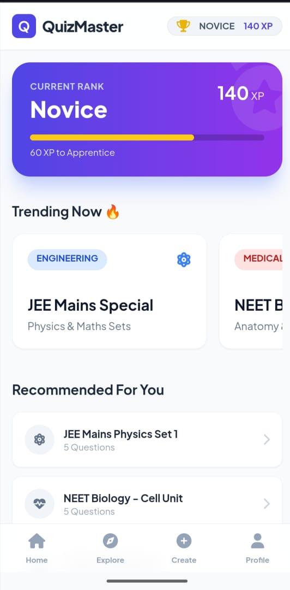
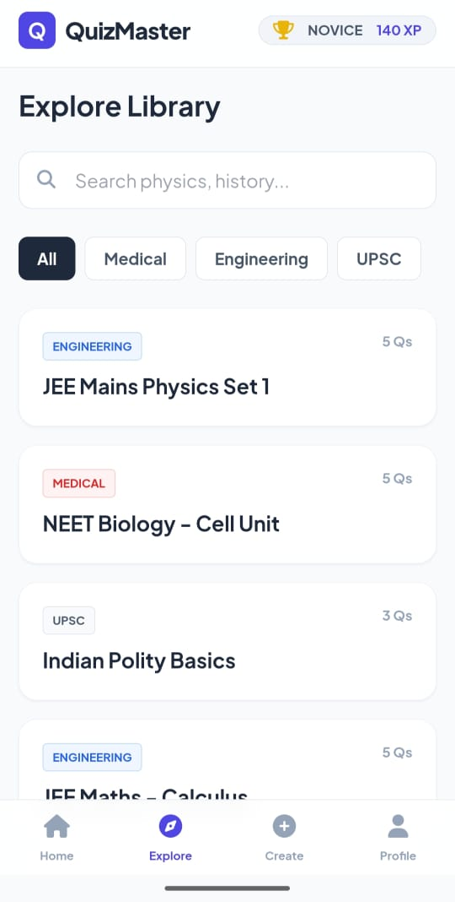
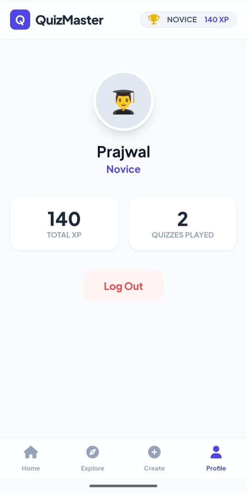

# 🎮 QuizMaster - Gamified Quiz Platform

> **Task 2 Submission** for **CodSoft Web Development Internship**
>
> A mobile-first, gamified quiz application built with HTML, Tailwind CSS, and JavaScript.

## 🚀 Live Demo
**https://quizzmaster7.netlify.app/**

---

## ✨ Features

### 🏆 Gamification System
- **XP & Ranking:** Users earn XP for every correct answer and rank up (Novice ➔ Legend).
- **Progress Tracking:** Visual progress bars for rank advancement and quiz completion.
- **Dynamic Stats:** User profile updates in real-time.

### 📚 Extensive Question Library
- **Engineering:** JEE Mains (Physics, Maths), Core Engineering subjects.
- **Medical:** NEET Biology, Anatomy, Zoology.
- **Competitive Exams:** UPSC Prelims, MPSC, General Knowledge.
- **State Boards:** HSC & SSC Maharashtra specific sets.

### 📱 Mobile-First UI/UX
- **App-Like Feel:** Bottom navigation bar for easy access on mobile devices.
- **Explore & Search:** Smart filtering system to find quizzes by category or keyword.
- **Responsive Design:** Built with Tailwind CSS to look perfect on any screen size.

---

## 📸 Screenshots

| Home Dashboard | Explore Library | User Profile |
|:---:|:---:|:---:|
|  |  |  |

---

## 🛠️ Tech Stack
- **Frontend:** HTML5
- **Styling:** Tailwind CSS (CDN)
- **Logic:** Vanilla JavaScript (ES6+)
- **Storage:** LocalStorage (No backend required - data persists in the browser)

## 📂 File Structure
```text
CODSOFT/
├── Task1_Portfolio/   # Previous Task
└── Task2_Quizz/       # Current Task
    ├── index.html     # Main Application File
    ├── Home.jpg       # Screenshot for README
    ├── Explore.jpg    # Screenshot for README
    ├── Profile.jpg    # Screenshot for README
    └── README.md      # Project Documentation